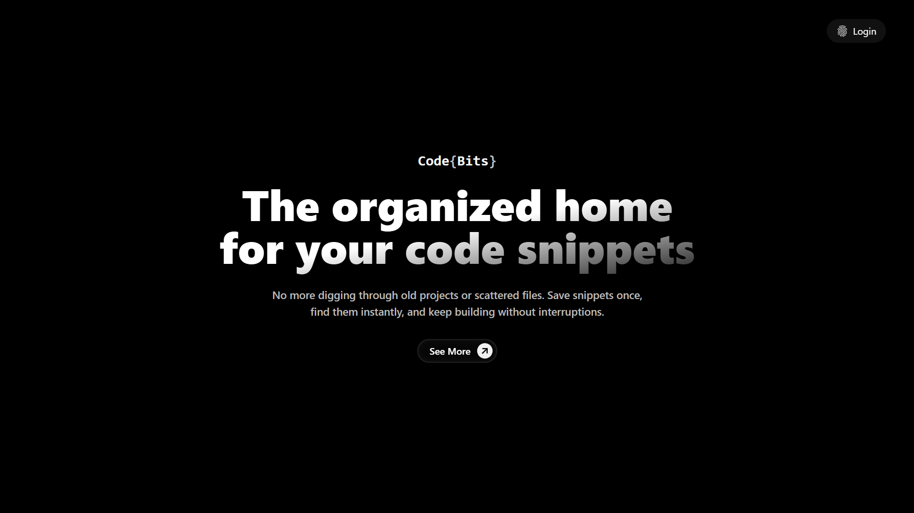
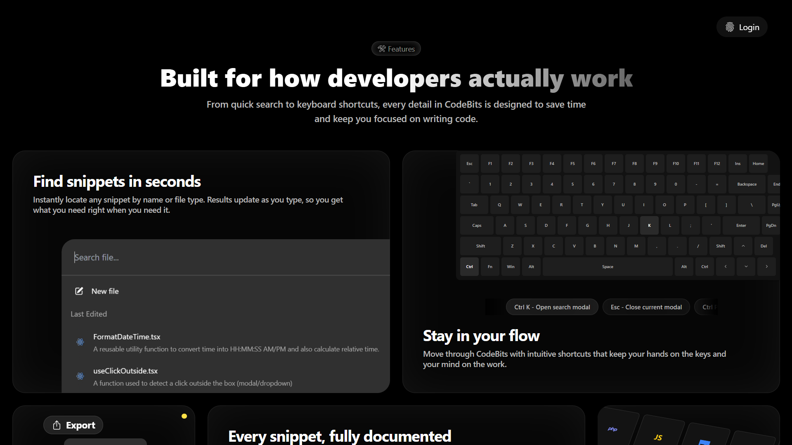
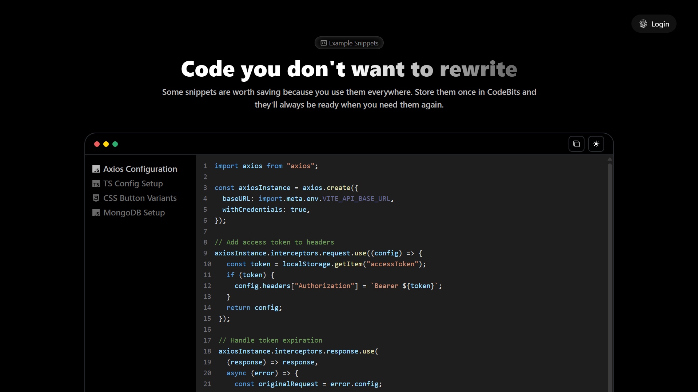
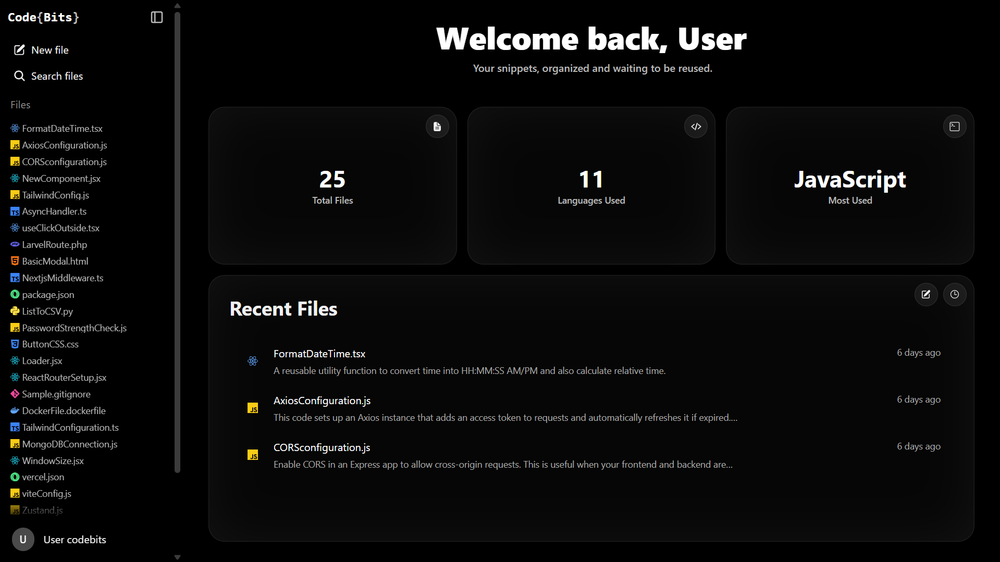

# CodeBits

CodeBits is a full-stack web application that lets users create, manage, and organize code snippets with a powerful VS Code-like editor experience, built using Monaco Editor. It’s designed for developers who want a clean, distraction-free place to store their useful code bits.

 

## Features

- 🔐 User authentication (login/signup/logout)
- 📁 Snippet organization with title, language, and description
- 🧠 Monaco Editor integration (with syntax highlighting, autocompletion)
- 📝 Inline editing of snippets
- 💾 Autosave with "Saving..." indicator
- 📜 History of last updates
- 📤 Copy to clipboard with visual feedback
- 🔍 Global search (with keyboard shortcut)
- 🌙 Dark/light mode toggle
- ⚙️ Settings: update password, delete account
- 📱 Responsive design for mobile and desktop

 

## Tech Stack

**Frontend:**
- React
- TypeScript
- Tailwind CSS
- Zustand (global state)
- React Router
- Monaco Editor
- Framer Motion

**Backend:**
- Node.js
- Express
- MongoDB
- JWT authentication
- Cookies for session management

 

## Live Website

Check out live site: [CodeBits](https://usecodebits.vercel.app)

Use the following credentials to log in and explore the full functionality of the website:

- **Email**: user@example.com
- **Password**: password

 

## Screenshots

### Landing page

### Features section

### Showcase section

### Logged in Home page

### File page

 

## License

This project is created for **learning and demonstration purposes only**. The source code is available for reference but should not be used for commercial projects without permission.

